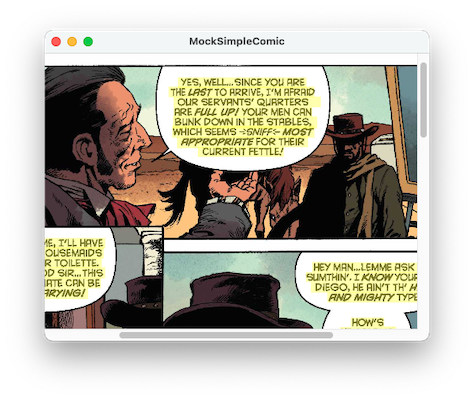

# MockSimpleComic
A testbed for using Apple's Vision framework with SimpleComic

This uses an NSImageView in a NSScrollView as a toy version of TSSTPageView. It has one page,
a compiled-in page from Django Zorro as sample data.

When run, it displays that page, scaled, in scrollbars. It initially covers most of the page
with a yellow tint.

It runs the Vision.framework OCR (Optical Character Recognition) engine. Once that completes, 
you can use the mouse to select text in place (look for the i-Beam cursor), and it tints just 
the places where it recognized text.

All of the actual OCRing is moved off to a OCRVision object, which provides a simple API for
OCRing.

This app creates a `VNRecognizeTextRequest` to recognize all the text in an image. That's all you need
to select individual lines of text in the image, or if you just need the text to
index it for Spotlight.

* Click and drag to select. Selection is by "words" (whitespace delimited).
* Control-Click on selected text for a contextual menu. (Simple Comic uses right click for its
magnifying glass.)
* Command-Click and drag to extend a selection.

The selection is represented by a dictionary where the key is a `VNRecognizedTextObservation` and the 
value is the `NSRange` of the string that interected the rectangle dragged out by the mouse.

On the menubar, **Select All**, **Copy**, and **Start Speaking** work, as do items on the Services submenu.


### Classes

**SimpleImagePageView** - the toy model of a TSSTPageView: an NSImageView in scrollbars

**OCRVision/OCRTracker** - provides mouse tracking and selection drawing for the SimpleImagePageView
Not a view itself, I designed it to be easy to add to an existing view.

**OCRVision/OCRVision** - provides a simple API for actually performing the OCR

### Example

Example of the start of the text the Vision framework found with this sample page.



```
YES, WELL... SINCE YOU ARE
THE LAST TO ARRIVE, I'M AFRAID
OUR SERVANTS' QUARTERS
ARE FULL UP! YOUR MEN CAN
BUNK DOWN IN THE STABLES,
WHICH SEEMS -SNIFF& MOST
APPROPRIATE FOR THEIR
CURRENT FETTLE/ …
```
### License

Open source under the Apache License Version 2 license. If you wish to use this under a
different license, plese get in touch with me.
